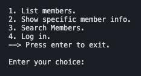
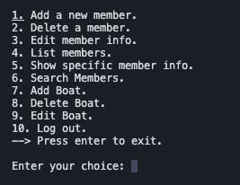

# Assignment 2 - Grade 3
##### Kateryna Melnyk, Paolo Molinaro, Richard Willhelm Oelschläger

## Changes of the Authentication mechanism according to the Grade 3 review
In order to protect the model *Register* methods from the execution by a not authorized user, we decided to implement the following changes:
 - *boolean getAuthStatus()* method was added to the *AuthenticatorInterface*. *Authenticator* that implements *AuthenticatorInterface* has a private boolean attribute, that is set to true in the *login* method if the user is authenticated;
 - *setIsAuthenticated(AuthenticatorInterface auth)* method was added to the *Register*. This method updates *Register* private boolean *isAuthenticated* inside every loop of the *AppManager* *runApp* method by call to the *getAuthStatus()* method (mentioned above). 
 - in *Register* methods *addMember* and *delMember* we showed that they will execute only if *isAuthenticated* is set to true. The same if conditional check can be implemented in the other methods, that are allowed to be executed only within an authorized user choices (all add and delete boat methods, member and boat edit methods);

## 1. Application purpose

This Java console application is developed with the purpose of servicing a yacht club registration process. The application provides functionality for adding, deleting and editing information about the club members and their boats as well as displaying all the content of the yacht club registry or details of any particular member. The application offers fast access to necessary information and simple navigation through all options. 

## 2. Main menu options
### 2.1 Not authorized user main menu
The application main menu consists of 4 options to choose from and the exit option to quit the program. The options 1-3 represent functionality of searching and displaying the member data. The 4 option is used for user authentication. The user choice should be provided to **Enter your choice:** field in order to get access to the specific main menu items or exit the program.

### 2.2 Authorized user main menu
The application main menu consists of 10 options to choose from and the exit option to quit the program. The options 1-6 represent functionality of accessing (creating, retrieving, updating, deleting and searching) the member data. The options 7-9 are intended for working with and modifying the boat information. The 10 option executes log out and return to the not authorized user main menu. The user choice should be provided to **Enter your choice:** field in order to get access to the specific main menu items or exit the program.

## 3. Login option
In order to get access to the authorized user main menu select option 4 in the not authorized user menu and provide the following information:

- id: **aa1111**
- password: **aa1111**

## 4. Member options functionality
### 4.1 Add member 
Adding a member to the registry of the yacht club so information can be stored and processed.
1. Select option 1 from the main menu.
2. Provide a 12 digit personal number.
    - if the member already exists in the registry an error message will be displayed and the application returns to the main menu.
3. Provide the full name of the member.
    
4. A success message will be displayed and the application returns to the main menu.
   
### 4.2 Delete member 
Removing a member from the registry of the yach club if the member is no longer a part of the club for any reason.
1. Select option 2 from the main menu.
2. Provide a member ID of the format xy1234 where x is the first letter of the first name and y is the first letter of the last name.
3. - if the member is found in the registry then he is removed, a success message is displayed and the application returns to the main menu.
    - if the member is not found in the registry then an error message is displayed and the application returns to the main menu.

### 4.3 Edit member
Editing the information about a member in the registry in case of changes or errors when initially adding the member.
1. Select option 3 from the main menu.
2. Provide a member ID of the format xy1234 where x is the first letter of the first name and y is the first letter of the last name.
    - If the provided ID is not found in the registry then an error message is displayed and the application returns to the main menu.
3. The edit member menu is displayed.
4. Select whether to edit the name, personal number or all information of the member by selecting 1,2 or 3.
    - if 1 was selected provide the full name of the member after which the name is edited, a success message is displayed and the application returns to the main menu.
    - if 2 was selected provide a 12 digit personal number after which the personal number is edited, a success message is displayed and the application returns to the main menu.
    - if 3 was selected provide the full name of the member and a 12 digit personal number after which the name and personal number are edited, a success message is displayed and the application returns to the main menu.
    

### 4.4 List members
Providing a list of all the members registered in the yacht club in two different variants. A verbose list with complete information and a compact version of the list with only essential data can be displayed.
1. Select option 4 (authorized user menu) or option 1 (not authorized user menu).
2. The List members menu is displayed.
3. Select whether to view a verbose list or a compact list by selecting 1 or 2.
    - if 1 was selected a verbose list of the members is displayed, depicting name, personal number, member id and boats with boat information and the application returns to the main menu.
    - if 2 was selected a compact list of the members is displayed, depicting name, member id and number of boats and the application returns to the main menu.

### 4.5 Show specific member information
Displaying information available corespoinding to an existing member of the yacht club.
1. Select option 5 (authorized user menu) or option 2 (not authorized user menu).
2. Provide a member ID of the format xy1234 where x is the first letter of the first name and y is the first letter of the last name.
    - If the provided ID is not found in the registry then an error message is displayed and the application returns to the main menu.
    -  If the provided ID is found in the registry then the name, personal number, member id and boats with boat information are displayed and the application returns to the main menu.

### 4.6 Search members
Providing functionality for the selection of members with a certain name (or a name that contains a specific sequence of characters) and members who own boats of the certain type.
1. Select option 6 (authorized user menu) or option 3 (not authorized user menu).
2. The search members menu is displayed.
3. Select whether to search members based on the name or boat type search request or press enter to return to the main menu.
    - if 1 was selected provide the full name or the name substring in order to diplay verbose information of the found members if such exist in the yacht club register.
    - if 2 was selected choose whether the boat is a sailboat, motorsailer, kayak/canoe or other by selecting 1,2,3 or 4 in order to display verbose information of the found members who own boats of the certain type.

If no members data was fetched for each of the options then an error message is displayed. Application returns to the main menu after executing the result of the selected options.

##  5. Boat options functionality
### 5.1 Add boat
Add a boat owned by a member to the registry of the yacht club.
1. Select option 7 from the main menu.
2. Provide a member ID of the format xy1234 where x is the first letter of the first name and y is the first letter of the last name.
    - If the provided ID is not found in the registry then an error message is displayed and the application returns to the main menu.
3. Provide a 6 digit boat registration number 
    - if the boat already exists in the registry an error message will be displayed and the application returns to the main menu.
4. Provide the length of the boat between 0.01 and 99.99.
5. The boat type menu is displayed.
6. Select whether the boat is a sailboat, motorsailer , kayak/canoe or other by selecting 1,2,3 or 4.
7. A success message will be displayed and the application returns to the main menu.

### 5.2 Delete boat
Remove a boat from the registry of the yacht club in case the boat was sold or oterwise disposed of.
1. Select option 8 from the main menu.
2. Provide a member ID of the format xy1234 where x is the first letter of the first name and y is the first letter of the last name.
    - If the provided ID is not found in the registry then an error message is displayed and the application returns to the main menu.
3. Provide a 6 digit boat registration number 
    - if  the boat exists in the registry the boat is removed, a success message will be displayed and the application returns to the main menu.
    - if the boat does not  exists in the registry an error message will be displayed and the application returns to the main menu.

### 5.3 Edit boat
Edit information about a boat in the registry in case of changes or errors when initially adding the boat.
1. Select option 9 from the main menu.
2. Provide a member ID of the format xy1234 where x is the first letter of the first name and y is the first letter of the last name.
    - If the provided ID is not found in the registry then an error message is displayed and the application returns to the main menu.
3. Provide a 6 digit boat registration number 
    - if the boat does not  exists in the registry an error message will be displayed and the application returns to the main menu.
4. The edit boat menu is displayed.
5. Select whether to edit the length, type or all information of the boat by selecting 1,2 or 3.
    - if 1 was selected provide the length of the boat between 0.01 and 99.99 after which the length of the boat will be edited, a success message is displayed and the application returns to the main menu.
    - if 2 was selected the boat type menu is displayed.
        - Select whether the boat is a sailboat, motorsailer , kayak/canoe or other by selecting 1,2,3 or 4, after which the type of the boat will be edited, a success message is displayed and the application returns to the main menu.
    - if 3 was selected provide the length of the boat between 0.01 and 99.99 after which the boat type menu is displayed.
        - Select whether the boat is a sailboat, motorsailer , kayak/canoe or other by selecting 1,2,3 or 4, after which the type of the boat will be edited, a success message is displayed and the application returns to the main menu.

## 6. Persistence details

The persistence file format implemented in the current application is JSON.
Save and load register coherence to the business model (unique id for each member) is enforced in the persistence layer. 

## 7. Planned features

- complex selection/search of members
- flexible persistence-design when adding other types of loading/saving data

