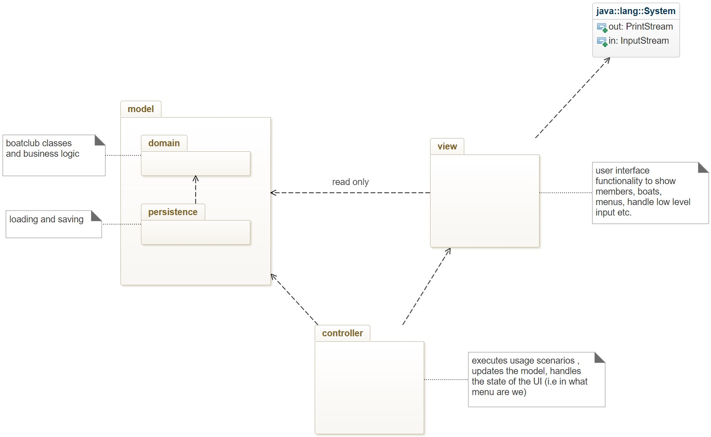

# Boatclub OO-Design
This document describes the design according to the requirements presented in assignment 2.

## Architectural Overview
The application uses the model-view-controller (MVC) architectural pattern. The view is passive and gets called from the controller. The view may only read information from the model, not directly change it.

## Detailed Design
### Class Diagram
_[updated 28/10/2021]_

The App class responsible for starting the application is not showed in the diagram.
Said class is responsible for the creation of the Register, Persistence, Authentication, UserInterface and AppManager.

The Interfaces _(in green)_ are chosen for modularity, giving the possibility for future implementation of various persistence managers and different user interfaces.
As well as different authentication method and search strategies.

The Register class functions as a facade for the Domain, being the expert, it delegates to the Member and to the Boat all the actions chosen by the user.

The Action is the realization of the chosen option by the user, via user interface. 

**NOTE:** _For readability the dependencies from each Action (and ListMenu) to the searchInterface has not been displayed, but it exists.
Also, Login class has a dependency on the Secretary class, but since the Authenticator package has a dependency to the Secretary itself we decided not to show it._

When the user chooses to list the members or to show the specific information about a member, the class ListMenu is called to display the selected information to the user reading directly from the Domain utilizing iterators.

The Secretary class only consists of a hardcoded secretary for login demo purposes.
In a more complete implementation a map of Users (in our case called for simplicity "Secretary") that can authenticate in the system would have been loaded from a different file in the persistence into a map attribute of said class, to keep them separated form the registry, possibly with an enforced encryption.
